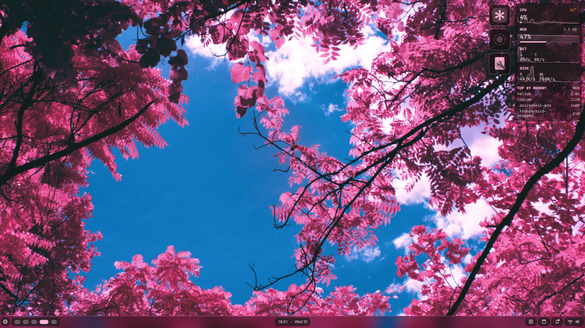

# ❄️ NixOS

My NixOS daily driver. \
Mess? Kinda. Cleaning? Working on that.



[](https://nixos.org)
[](https://github.com/xddxdd/nix-cachyos-kernel)
[](https://fishshell.com)
[](#desktop-environments)

## Features

### Desktop Environments

* **Niri (`minimal` profile)**: Wayland compositor using `dms-shell`.
  * Theming managed via `mutagen`.
  * System monitoring bar.
  * Nautilus file manager with `ffmpegthumbnailer` support.
  * `foot` terminal.
* **KDE Plasma (`fluid` profile)**: Plasma 6 environment with customized SDDM theme.
* **Other Environments**: Setup modules available for GNOME and Hyprland.
* **Testing Sandbox (`preview` profile)**: QEMU virtual machine target for configuration testing.

### Boot & Login Manager

* **GRUB 2**: Bootloader configured with the `catppuccin-grub` package. Uses OS Prober, a 10-second timeout, and systemd in initrd.
* **Plymouth**: Boot splash screen with silent boot logging parameters (`quiet`, `splash`).
* **SDDM**: Login manager using `silentSDDM` configured with the `catppuccin-mocha` theme.

### Performance & Kernel Tuning

* **Kernel**: Linux CachyOS kernel (`nix-cachyos-kernel`) with LTO and `x86_64-v4` optimizations.
* **Scheduler**: Sched-ext user-space scheduler utilizing `scx_bpfland`.
* **Network**: TCP BBR congestion control, `fq` network queue, TCP Fast Open, and MTU probing.
* **I/O Schedulers**: Hardware-aware scheduling rules (none for NVMe, `mq-deadline` for SATA SSDs, `bfq` for HDDs).
* **Hardware Interrupts**: `irqbalance` enabled.
* **DDC/CI Support**: `i2c` enabled for monitor control via `ddcutil`.

### Shell Environment

* **Interactive Shell**: Fish shell configured with:
  * `starship` prompt.
  * `zoxide` navigation helper.
  * `direnv` / `nix-direnv` workspace integration.
  * Plugins: `autopair`, `done` notification, `fzf-fish` search, `grc` colorizer, `foreign-env`.
  * Colored man pages.

### Packages & CLI Tools

* **CLI Utilities**: `yazi` (file manager), `eza`, `bat`, `btop`, `fd`, `ripgrep`, `dust`, `ncdu`, `_7zz-rar`.
* **Flatpak**: Declarative flatpaks managed via `nix-flatpak`.
* **Compatibility**: FHS environment wrapper (`fhs-env.nix`).

### Services & Security

* **Virtualization**: Docker, KVM/QEMU, `virt-manager`, and Android SDK developer settings (bundled under `specialisation.virtualisation` profile).
* **DNS**: AdGuard Home and NextDNS.
* **Authentication**: Polkit GNOME authentication agent.

## Configuration Structure

```text
.nixos-config/
├── flake.nix             # Flake entry point (hosts, inputs, & system-wide builders)
├── flake.lock            # Lockfile managing pin points of nixpkgs & modules
├── LICENSE               # MIT License
├── README.md             # This guide
├── hosts/
│   ├── common.nix        # Common host attributes (Timezone, Locales)
│   ├── laptop/
│   │   ├── configuration.nix      # Host-specific settings & Specialisations
│   │   ├── hardware-configuration.nix # Generated machine/partition layout
│   │   └── system-packages.nix    # Target channel settings & global apps
│   └── preview/
│       └── configuration.nix      # Dedicated QEMU VM preview profile
├── modules/
│   ├── base.nix          # Global modules imported on all systems
│   ├── boot/             # bootloader and plymouth splash modules
│   ├── appearance/       # Styling, custom fonts, SDDM, Niri/KDE profiles
│   ├── packages/         # Core groups (CLI tools, Internet, Media, Dev)
│   ├── services/         # AdGuard, NextDNS, virtualization, Flatpak wrappers
│   ├── shell/            # Shell configurations (Fish, Nu, Zsh)
│   └── system-tuning/    # Performance tuning, disks, swap, graphics, kernels
└── users/
    └── mrbot.nix         # User profile definition (groups, shell, password-hashes)
```

## Installation Guide

> [!WARNING]
> **For First-Time Installers:** This repository is tailored for a specific user and hardware setup. You **must** adapt it to your system before installation to avoid permission issues and boot failures.

### 1. Prepare Partitions & Mount

Create and mount your partitions according to your preferred filesystem layout. Ensure the boot loader directory is fully mounted:

* **Root (`/`)**: Mount at `/mnt` (e.g., ext4, btrfs, zfs)
* **Boot (`/boot`)**: Mount at `/mnt/boot` (e.g., fat32)
* **Home (`/home`)**: *(Optional)* Mount at `/mnt/home`

### 2. Clone the Configuration Flake

Boot into the installation media environment and clone this repository:

```bash
git clone https://github.com/fizzflip/nixos-config.git /mnt/etc/nixos/config
cd /mnt/etc/nixos/config
```

### 3. Generate Hardware Configuration

You need to generate a hardware profile specific to your machine.

> [!CAUTION]
> **Do not generate this in the root directory.** The flake expects the hardware configuration to be located inside your specific host directory (e.g., `hosts/laptop/`). If you use `--dir .` in the root of the workspace, you will need to manually move `hardware-configuration.nix` and delete the generated `configuration.nix`.

```bash
nixos-generate-config --show-hardware-config --root /mnt > hosts/laptop/hardware-configuration.nix
```

*Ensure you overwrite the existing `hardware-configuration.nix` in that folder.*

### 4. Personalize User Configuration

This setup currently hardcodes the `mrbot` user in several places and expects password hashes to be stored in external files rather than directly in the Nix code. Follow these steps to set up your own:

1. **Create your user profile:**
    Copy the existing user profile or create a new one based on the template below.

    ```bash
    cp users/mrbot.nix users/<your_username>.nix
    ```

2. **Configure your settings (`users/<your_username>.nix`):**
    * Update `users.users.<your_username>`.
    * Update `hashedPasswordFile` to point to `/etc/nixos/passwords/<your_username>`.
    * Customize your packages and preferred shell.

3. **Generate and Store Your Password:**
    Instead of storing the password directly in the nix file, this configuration relies on an external file. Create this file on your mounted system:

    ```bash
    mkdir -p /mnt/etc/nixos/passwords
    
    # Generate the sha-512 password hash
    mkpasswd -m sha-512 > /mnt/etc/nixos/passwords/<your_username>
    
    # Fallback if mkpasswd is not preinstalled on your installer media:
    # nix-shell -p mkpasswd --run "mkpasswd -m sha-512" > /mnt/etc/nixos/passwords/<your_username>
    ```

4. **Update Flake References:**
    Open `flake.nix` and update the base modules list (`baseModules`) to point to your new user file instead of `./users/mrbot.nix`.
    > [!NOTE]
    > If you decide to rename the `laptop` host directory to something else (e.g., `desktop`), you must also update all paths referencing `hosts/laptop/...` in your `flake.nix`.

5. **Replace Hardcoded Usernames:**
    You must replace `"mrbot"` with your `<your_username>` across the codebase. Specifically check:
    * `hosts/laptop/configuration.nix` (under `nix.settings.trusted-users`)
    * `modules/appearance/desktop-environment/hyprland.nix` (under `greetd` user)
    * `modules/services/virtualisation.nix` (under `libvirtd.members`)

    > [!WARNING]
    > If you skip this step, your new user will lack permissions to run Nix commands, and features like virtualization or the Hyprland greeter will fail to start.

<details>
<summary>User Template</summary>

```nix
{ pkgs, ... }:
{
  users.users.<username> = {
    isNormalUser = true;
    hashedPasswordFile = "/etc/nixos/passwords/<username>";
    extraGroups = [
      "wheel" "kvm" "video" "audio" "networkmanager"
    ];
    shell = pkgs.fish; # your preferred shell
    packages = with pkgs; [
      # your custom user packages
    ];
  };
}
```

</details>

### 5. Run the Installer

Choose your desired configuration profile from `flake.nix` (e.g., `minimal` or `fluid`).

> [!IMPORTANT]
> **Nix flakes ignore files that are not tracked by Git!** If you renamed or added new files (like your `<username>.nix` or the hardware config), you must stage them. Otherwise, the installer will throw a missing file error.
>
> ```bash
> git add .
> ```

Execute the installation:

```bash
nixos-install --flake .#minimal --root /mnt --verbose --show-trace
```

## Maintenance & System Operations

### Rebuilding and Switching

To apply changes to the system:

```bash
# Rebuild and switch using Niri profile
nixos-rebuild switch --flake .#minimal --verbose --show-trace

# Rebuild and switch using KDE Plasma profile
nixos-rebuild switch --flake .#fluid --verbose --show-trace
```

### Toggle Specialisations (Virtualization & Development)

The virtualization configuration is defined as a Specialisation block and can be loaded at runtime:

```bash
# Switch to the virtualization profile at runtime
sudo /run/current-system/specialisation/virtualisation/bin/switch
```

### Running the Sandbox Preview VM

To launch the QEMU virtual machine for configuration evaluation:

```bash
# Launch preview environment (configured with Niri and Fish)
nix run .#preview

# Or launch using the default flake application
nix run
```

VM configuration details:

* **CPU & Memory**: 4 CPU cores, 4GB RAM.
* **Graphics & Display**: GTK display with hardware OpenGL rendering (`virtio-vga-gl`), set to `1920x1080` resolution.
* **Login**: Login as `mrbot` with the password `nixos` (bypasses password files).

## Documentation Resources

* [NixOS Search](https://search.nixos.org) - Package and option search.
* [MyNixOS](https://mynixos.com) - Formatted options and parameters list.
* [NixOS Manual](https://nixos.org/manual/nixos) - Operations guide.
* [NixOS Wiki](https://nixos.wiki) - Community resources.
