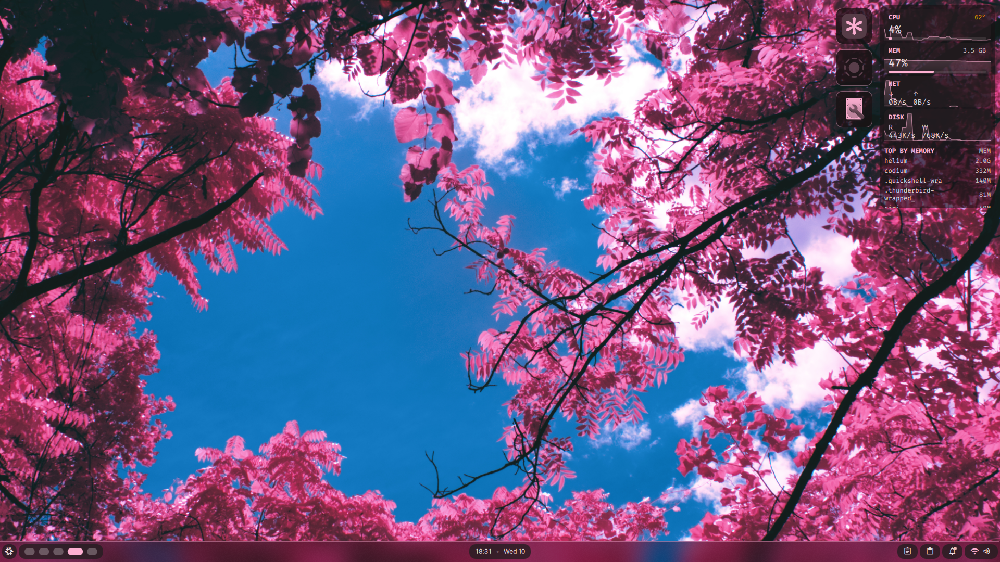

# ❄️ NixOS

My NixOS daily driver. \
Mess? Kinda. Cleaning? Working on that.



[Wallpaper](https://wallhaven.cc/w/6lqvql) / [Creator](https://wallhaven.cc/user/Trashbuff)

[](https://nixos.org)
[](https://en.wikipedia.org/wiki/Zen_kernel)
[](https://fishshell.com)
[](#desktop-environments)

## Features

### Desktop Environments

- **Niri (`minimal` profile)**: Wayland compositor using `dms-shell`.
  - Dynamic theming via `dms-shell` and `wallust`.
  - System monitoring and audio wavelength bar.
  - PAM service configuration for `dankshell` authentication.
  - Nautilus file manager with `ffmpegthumbnailer` and GNOME Sushi support.
  - `foot` terminal, `nomacs` image viewer, and `xwayland-satellite`.
- **KDE Plasma (`fluid` profile)**: Plasma 6 environment with customized SDDM theme.
- **GNOME (`modules/appearance/desktop-environment/gnome.nix`)**: Available GNOME profile with GTK themes and extensions.
- **Testing Sandbox (`preview` profile)**: QEMU virtual machine target for configuration testing.

### Boot & Login Manager

- **GRUB 2**: Bootloader configured with the `catppuccin-grub` package. Uses OS Prober, a 10-second timeout, and systemd in initrd.
- **Plymouth**: Boot splash screen with silent boot logging parameters (`quiet`, `splash`).
- **SDDM**: Login manager using `silentSDDM` configured with the `catppuccin-mocha` theme.

### Performance & Kernel Tuning

- **Kernel**: Linux Zen kernel (`linuxPackages_zen`) with disabled CPU mitigations (`mitigations=off`).
- **Graphics & Display**: Intel iGPU hardware acceleration (GuC/HuC submission, `iHD` driver, VPL runtime), Framebuffer Compression (FBC), PSR2, and Fastboot.
- **Network**: TCP BBR congestion control, `fq` network queue, TCP Fast Open, MTU probing, and socket buffer tuning.
- **I/O Schedulers & Disks**: Hardware-aware scheduling rules (none for NVMe, `mq-deadline` for SATA SSDs, `bfq` for HDDs), periodic SSD TRIM, and tmpfs `/tmp`.
- **Scheduler**: Extensible `scx-loader` framework utilizing `scx_lavd` scheduler by default with `scx_bpfland` fallback options.
- **Memory & Swap**: ZRAM swap with `zstd` compression (1:1 RAM ratio) and tuned swappiness (`vm.swappiness=150`).
- **DDC/CI Support**: `i2c` enabled for monitor control via `ddcutil`.

### Shell Environment

- **Interactive Shell**: Fish shell configured with:
  - `starship` prompt.
  - `zoxide` navigation helper.
  - `direnv` / `nix-direnv` workspace integration.
  - Plugins: `autopair`, `done` notification, `fzf-fish` search, `grc` colorizer, `foreign-env`.
  - Colored man pages.

### Packages & CLI Tools

- **CLI Utilities**: `nh` (Nix Helper), `yazi` (file manager), `eza`, `bat`, `btop`, `fd`, `ripgrep`, `dust`, `ncdu`, `_7zz-rar`, `imagemagick`, `chafa`.
- **Browsers & Dev**: Helium Browser, Mullvad Browser, Zed Editor, VSCodium FHS, JetBrains IDEs, Typst toolchain.
- **Flatpak**: Declarative flatpaks managed via `nix-flatpak`.
- **Compatibility**: FHS environment wrapper (`fhs-env.nix`).

### Services & Security

- **Lab & Virtualization**: Docker, KVM/QEMU, `virt-manager`, `winboat`, Android Studio & Waydroid (`android.nix`), Wireshark, Cisco Packet Tracer, Figma, and IBM Bob IDE (`specialisation.lab` profile).
- **Systemd Service Sandboxing**: Dedicated security overrides reducing systemd-analyze exposure levels for `nextdns`, `mandb`, `iwd`, `scx_loader`, `nscd`, and `systemd-rfkill`.
- **Kernel & Sysctl Security**: Kernel image protection (`protectKernelImage`), restricted ptrace scope, sysctl network and filesystem security hardening.
- **DNS**: NextDNS.
- **Authentication**: Polkit GNOME authentication agent.

## Configuration Options

- **`my.user.name`** (`string`) - Primary system username.
- **`my.user.hashedPasswordFile`** (`path` or `null`) - Defaults to `/etc/nixos/passwords/${my.user.name}`.
- **`my.user.extraGroups`** (`list of strings`) - Default groups.
- **`my.user.shell`** (`package`) - Default: `pkgs.fish`.
- **`my.desktop.environment`** (`enum: niri, kde, gnome, none`) - Desktop environment.
- **`my.configPath`** (`string`) - Path to NixOS config repo, default `~/.nixos-config`.
- **`my.packages.minimal`** (`bool`) - Omits heavy IDEs, browsers, media apps, and Flatpaks when set to `true`.

## Configuration Structure

```text
.nixos-config/
├── flake.nix             # Flake entry point (hosts, inputs, & system-wide builders)
├── flake.lock            # Lockfile managing pin points of nixpkgs & modules
├── LICENSE               # MIT License
├── README.md             # This guide
├── hosts/
│   ├── common.nix        # Common host attributes (Timezone, Locales)
│   ├── laptop/
│   │   ├── configuration.nix      # Host-specific settings & Specialisations
│   │   └── hardware-configuration.nix # Generated machine/partition layout
│   └── preview/
│       └── configuration.nix      # Dedicated QEMU VM preview profile
├── modules/
│   ├── base.nix          # Global modules imported on all systems
│   ├── appearance/       # Styling, custom fonts, SDDM, Niri/KDE/GNOME profiles
│   │   └── desktop-environment/ # Desktop environment dispatcher
│   ├── boot/             # Bootloader and Plymouth splash modules
│   ├── core/             # Core configuration options
│   │   └── options.nix   # Custom option declarations (my.* namespace)
│   ├── packages/         # Core groups (CLI tools, Internet, Media, Dev, Lab)
│   │   └── lab/          # Modularized lab tools (IBM Bob, Wireshark, Figma, Packet Tracer)
│   ├── services/         # NextDNS, virtualization, Android, Flatpak wrappers
│   ├── shell/            # Shell configurations (Fish, Nu)
│   └── system-tuning/    # Performance, graphics, disks, swap, kernel, security, & service hardening
└── users/
    ├── default.nix       # Dynamic primary user profile definition
    └── nini.nix          # Secondary user profile definition
```

## Installation Guide

> [!WARNING]
> **For First-Time Installers:** This repository is tailored for a specific user and hardware setup. You **must** adapt it to your system before installation to avoid permission issues and boot failures.

### 1. Prepare Partitions & Mount

Create and mount your partitions according to your preferred filesystem layout. Ensure the boot loader directory is fully mounted:

- **Root (`/`)**: Mount at `/mnt` (e.g., ext4, btrfs, zfs)
- **Boot (`/boot`)**: Mount at `/mnt/boot` (e.g., fat32)
- **Home (`/home`)**: _(Optional)_ Mount at `/mnt/home`

### 2. Clone the Configuration Flake

Boot into the installation media environment and clone this repository:

```bash
git clone https://github.com/fizzflip/nixos-config.git /mnt/etc/nixos/config
cd /mnt/etc/nixos/config
```

### 3. Generate Hardware Configuration

You need to generate a hardware profile specific to your machine.

> [!CAUTION]
> **Do not generate this in the root directory.** The flake expects the hardware configuration to be located inside your specific host directory (e.g., `hosts/laptop/`). If you use `--dir .` in the root of the workspace, you will need to manually move `hardware-configuration.nix` and delete the generated `configuration.nix`.

```bash
nixos-generate-config --show-hardware-config --root /mnt > hosts/laptop/hardware-configuration.nix
```

_Ensure you overwrite the existing `hardware-configuration.nix` in that folder._

### 4. Personalize User Configuration

1. Open `flake.nix`.
2. Change `my.user.name = "mrbot"` to your username in each profile.
3. Generate and store your password:

   ```bash
   mkdir -p /mnt/etc/nixos/passwords

   # Generate the sha-512 password hash
   mkpasswd -m sha-512 > /mnt/etc/nixos/passwords/<your_username>

   # Fallback if mkpasswd is not preinstalled on your installer media:
   # nix-shell -p mkpasswd --run "mkpasswd -m sha-512" > /mnt/etc/nixos/passwords/<your_username>
   ```

4. That's it - no more grep-replacing across the codebase!

### 5. Run the Installer

Choose your desired configuration profile from `flake.nix` (e.g., `minimal` or `fluid`).

> [!IMPORTANT]
> **Nix flakes ignore files that are not tracked by Git!** If you renamed or added new files (like the hardware config), you must stage them. Otherwise, the installer will throw a missing file error.
>
> ```bash
> git add .
> ```

Execute the installation:

```bash
nixos-install --flake .#minimal --root /mnt --verbose --show-trace
```

## Maintenance & System Operations

### Rebuilding and Switching

To apply changes to the system:

```bash
# Rebuild and switch using Niri profile
nixos-rebuild switch --flake .#minimal --verbose --show-trace

# Rebuild and switch using KDE Plasma profile
nixos-rebuild switch --flake .#fluid --verbose --show-trace
```

### Toggle Specialisation (Lab & Virtualization)

The lab configuration is defined as a Specialisation block and can be loaded at runtime:

```bash
# Switch to the lab profile at runtime
sudo /run/current-system/specialisation/lab/bin/switch
```

### Running the Sandbox Preview VM

To launch the QEMU virtual machine for configuration evaluation:

```bash
# Launch Minimal preview environment (lightweight, bare essentials only)
nix run .#preview
# Or launch using the default flake application
nix run

# Launch Full preview environment (contains all IDEs, media apps, flatpaks, and Lab tools)
nix run .#preview-full
```

VM configuration details:

- **CPU & Memory**: 4 CPU cores, 4GB RAM.
- **Graphics & Display**: GTK display with hardware OpenGL rendering (`virtio-vga-gl`), set to `1920x1080` resolution.
- **Login**: Login as `mrbot` with the password `nixos` (bypasses password files).

## Documentation Resources

- [NixOS Search](https://search.nixos.org) - Package and option search.
- [MyNixOS](https://mynixos.com) - Formatted options and parameters list.
- [NixOS Manual](https://nixos.org/manual/nixos) - Operations guide.
- [NixOS Wiki](https://nixos.wiki) - Community resources.
